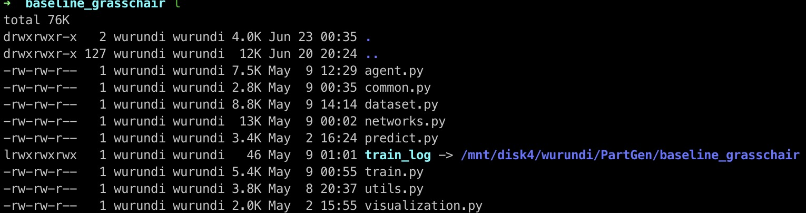
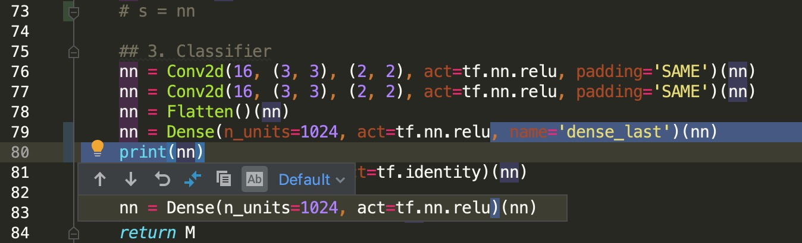

# EfficientResearchWork
Efficient research work environment setup for Computer Science and general workflow for Deep Learning experiments. Contribute to our lab [VCL](https://www.vcl-pku.cn).

## Contents
- [Work environment setup](#Work-environment-setup)
  - [Terminal](#Terminal)
  - [Shell](#Shell)
  - [Server](#Server)
    - [Connection](#Connection)
    - [tmux](#tmux)
  - [Code editor](#Code-editor)
    - [python](#python) : PyCharm
    - [C/C++](#C/C++)
    - vim
  - [Cloud Storage](#Cloud-Storage)
- [Deep Learning Experiments Workflow](#Deep-Learning-Experiments-Workflow)
  - [Virtual Environment](#Virtual-Environment): Anaconda
  - [Code structure](#Code-structure)
  - [Experiment organization](#Experiment-organization)
  - [Visualization](#Visualization)
  - [Debug Trick](#Debug-Trick)
- [Commonly used CG software](#Commonly-used-CG-software)
  - Blender
  - MeshLab
  - Unity

## Work environment setup

### Terminal

系统自带的terminal往往比较简单，不支持多窗口和各种定制。而在实验中经常需要开多个terminal窗口（比如我需要同时连多台服务器），所以系统自带的原始terminal使用起来会比较不方便。建议使用以下的terminal软件，以支持多窗口、分屏和快捷切换的特性。

- Linux: Terminator. 安装简单，例如[此处](https://blog.arturofm.com/install-terminator-terminal-emulator-in-ubuntu/)。
- Mac: [iTerm2](https://iterm2.com). 按照官网安装即可。
- Windows: 待补充。

  

安装完毕之后不需要掌握太多的功能，一般只需要用到多窗口、分屏的功能，掌握切换窗口/分屏的快捷键即可。能用键盘的操作就别用鼠标去点！此外，背景半透明等额外特性看个人需要是否使用。

### Shell

Shell对于工作效率可以说是重中之重了，一个好的shell能成倍提高工作效率！一般系统自带的shell都是未经配置的bash，功能比较简略。

在此，强烈推荐使用[zsh](https://www.zsh.org)及其插件管理工具[oh-my-zsh](https://github.com/robbyrussell/oh-my-zsh)!!! 其功能极大的简便了命令行操作，相信用过了都会觉得真香（看看Github 9万多star就知道了）。

- **安装与（推荐）配置过程**：  
  1. 按照[这里](https://github.com/robbyrussell/oh-my-zsh#getting-started)按照zsh和机器插件管理包oh-my-zsh。注意oh-my-zsh是zsh的一个插件管理包，我们还需要通过它来安装其他插件来实现各种强大的功能。
  2. 安装插件[zsh-autosuggestions](https://github.com/zsh-users/zsh-autosuggestions)，注意按照[这里](https://github.com/zsh-users/zsh-autosuggestions/blob/master/INSTALL.md#oh-my-zsh)的命令通过oh-my-zsh来方便安装。这个插件的功能是更强大的命令补全。
  3. 安装插件[zsh-syntax-highlighting](https://github.com/zsh-users/zsh-syntax-highlighting)，注意按照[这里](https://github.com/zsh-users/zsh-syntax-highlighting/blob/master/INSTALL.md#oh-my-zsh)的命令通过oh-my-zsh来方便安装。这个插件的功能是命令行的语法高亮，方便阅读命令的同时也会让你的命令行更加酷炫。
  4. 安装插件[extract](https://github.com/robbyrussell/oh-my-zsh/tree/master/plugins/extract#extract-plugin)，只需要在zsh的配置文件`~/.zshrc`里加一行即可。这个插件的功能是简化各类解压操作。
  5. 安装插件[git](https://github.com/robbyrussell/oh-my-zsh/tree/master/plugins/git)，可选，简化git的相关操作。

- **常用特性**：  
  -  命令补全。极其强大！系统自带的bash往往只能一个一个顺序地往上恢复历史的命令，而我们配置后的zsh可以迅速地恢复任意历史命令。例如我想恢复我的上一次python命令，简单的敲几个字母`pyt`后，历史的命令就显示出来的了，在按一下方向键⬆️就恢复了：  
  

  - 一键解压。linux下各类的压缩文件的解压缩命令往往不同，很难记住，extract插件让我们能够通过`x`这一个字母解压几乎所有类型的压缩文件。

  - 各种小的命令简化。我们配置的zsh自己alias了一些命令，如`..` = `cd ..`, `l` = `ls -alh`等等。

### Server
DL的实验基本都需要在服务器上跑，所以一些针对服务器的操作简化是很必要的。

- <a name="Connection"></a> **Connection**  
  通过`ssh username@server_ip`命令连接服务器是大家常用的操作，然而每次都需要输入用户名、服务器ip和密码是不是很麻烦。强烈推荐一个`ssh xxx`一键登录的操作

  1. **免密登录**.  
    原理是通过公私钥登录。我们先通过`ssh-keygen`生成一个rsa公私钥对：  
      ```bash
      $ ssh-keygen -t rsa
      ```  
      这样会在`~/.ssh`文件夹下生成一个公私钥对, `id_rsa`和`id_rsa.pub`（或者其他你命的名字）。接下来把公钥拷贝到服务器上：  
      ```bash
      $ ssh-copy-id -i ~/.ssh/id_rsa.pub username@server_ip
      ```  
      这样配置之后再通过`ssh username@server_ip`登录就不需要输密码了。

  2. **配置连接的别名**. 
    我们进一步配置`ssh`连接，通过`vim ~/.ssh/config`创建（打开）ssh的配置文件，写入： 
      ```
      Host lab
        Hostname 111.222.333.4
        User myname
        Port 22
        IdentityFile ~/.ssh/id_rsa
      ```
      这样我们就为`myname@111.222.333.4`建立了一个别名叫做`lab`，并且关联上了之前配置好的rsa的私钥。  
      以后只需要通过`ssh lab`即可直接登录服务器，比原来简便了很多。

- <a name="tmux"></a> **tmux**  
  [tmux](https://github.com/tmux/tmux)是一个unix-like系统下的命令行多路复用工具，可以帮助我们在命令行中同时开多个窗口，并且保证在其中跑的程序不会因为服务器连接的中断而停止，这对于长时间运行的实验（如神经网络训练）尤为重要。大多数人对tmux应该不陌生，也听过有用其他类似软件的。

  - **安装与推荐配置**：  
  1. 安装tmux，按照[这里](https://linuxize.com/post/getting-started-with-tmux/#installing-tmux)
  2. 配置tmux。同样tmux也可以通过配置来强大其功能并美化其外观，我个人使用的是这个[.tmux](https://github.com/gpakosz/.tmux)配置，安装简介，使用方便，外观好看。  
    
  

  - **常用操作**：  
  推荐阅读这个[指南](https://linuxize.com/post/getting-started-with-tmux/#starting-your-first-tmux-session)来熟悉tmux的常用操作和概念。推荐用一个session来管理一个project，里面的每一个window(或者panel)来管理一个实验，多个实验同时用不同的window(或者panel)来跑。  

### Code editor

- <a name="python"></a> **python**  
  强推[PyCharm](https://www.jetbrains.com/pycharm/)！！通过学校邮箱注册即可获得免费的专业版。  

  **常用特性**：
  - 远程服务器直连/同步。按官方指南[creating-a-remote-server-configuration](https://www.jetbrains.com/help/pycharm/creating-a-remote-server-configuration.html)操作即可。本地ide修改代码，文件即刻同步到服务器上，对于在服务器上跑实验但是又想本地改代码的人来说十分方便。
  - 使用远程服务器的python解释器。依旧官方指南[configuring-remote-interpreters-via-ssh](https://www.jetbrains.com/help/pycharm/configuring-remote-interpreters-via-ssh.html)。本地修改代码可以按照远程服务器的python解释器来进行补全和提示，不必再担心本地和远程环境不一样的问题。
  - 快捷键`crtl+B`（`command+B` for Mac）进行函数或变量声明的一键查询。
  - 快捷键`crtl+W`（`command+W` for Mac）快速关闭当前页。
  - 在pycharm内对一个project进行git管理。[官方指南](https://www.jetbrains.com/help/pycharm/using-git-integration.html?section=Windows%20or%20Linux#Using_Git_Integration.xml)写的比较复杂。

- <a name="C/C++"></a> **C/C++**  
  待补充。

### Cloud Storage
待补充。

## Deep Learning Experiments Workflow
> 这一部分针对有python和深度学习基础但实战经验不是很丰富的同学。  
> 若没有深度学习基础，推荐学习斯坦福公开课[CS231n](http://cs231n.stanford.edu)。  
> 若不熟悉深度学习框架，建议先学习一遍其官网的官方教程：[PyTorch](https://pytorch.org/tutorials/)，[TensorFlow](https://www.tensorflow.org/tutorials)，[TensorLayer](https://tensorlayer.readthedocs.io/en/latest/user/installation.html).  
> 硬件环境(nvidia-driver+CUDA+cudnn)的搭建：[yixin](http://yixina.net/doc/ubuntu.html).

一个深度学习的项目往往需要进行大量的调试和对比实验，而且debug往往比较困难，所以代码和实验的组织特别重要，特别要关注可复现性、易扩展性。

### Virtual Environment
不同的项目可能需要用到不同的python环境，所以用一些虚拟环境/python包管理工具将它们相互之间隔离开来是非常有好处的。
- Anaconda  
  [Anaconda](https://www.anaconda.com)提供了强大而方便的包管理与环境管理的功能。个人习惯于将不同深度学习框架配置到不同的环境中，如PyTorch, TensorFlow各自单独一个环境，以及为git上有些久远的python2项目单开一个python2环境，基本就能满足需求。  
  使用anaconda完成不同cuda版本环境并存->[这里](https://blog.kovalevskyi.com/multiple-version-of-cuda-libraries-on-the-same-machine-b9502d50ae77)。
  
- virtualenv
  待补充。

### Code structure
大多数深度学习的代码可以按照以下结构划分，将各个功能分割开来（便于debug和调试）：
- `config.py`  定义实验的超参数和全局变量，例如网络结构的超参数、learning rate、epoch数、实验/数据路径等。
- `dataset.py`  定义数据的供应流，提供获取数据的接口给`train.py`使用，例如pytorch里的DataLoader对象。
- `agent.py`  定义一个控制训练过程的容器，提供`train.py`需要的接口，特别是训练中间过程的保存与恢复。tensorflow V1里叫做session，pytorch里需要我们自己写。
- `train.py`  执行训练的主文件，尽量简短。
- `evaluate.py`  执行evaluatoin/prediction的主文件，尽量简短。
- `utils.py`  常用的工具函数和对象。
- 其他（如`visualization`等）

样例代码：[PyTorch_Template](/PyTorch_Template)

### Experiment organization
- 每一个实验开一个文件夹  
  在项目总目录下，每一次实验单开一个文件夹，作有意义的命名，这是为了实验的可复现和对比。  
  例如，第一次写好了一份代码并跑了一次完整的实验，该实验名为`baseline`放在项目总目录下。那么若我想把网络层数增加一倍再试试看，那么则先拷贝`baseline`的内容到一个新的文件夹`baseline_layer2x`下，然后在`baseline_layer2x`修改网络层数，之后再在该文件夹下跑新的实验。  
  
- 代码和数据分离  
  一般来说，服务器上的硬盘空间会进行划分，会有很大的空间专门划分给数据存储，另外有一部分用于常规文件。因此我们应尽量将数据放在大的硬盘分区内，与代码分离。这里说的数据既包括用于训练数据，也包括训练过程中产生的数据（训练日志，模型文件）等。所以训练过程中产生的数据`train_log`需要我们的代码将他们放到硬盘的数据分区中，但为了方便访问，我们可以在实验文件夹下建立一个软连接索引到实际存放的位置：  
  
- 使用git进行版本控制  
  使用git进行版本控制是很好的习惯，结合PyCharm的功能，可以很方便的让我们看到代码相对于之前的commit改动了什么：  
  
  
### Visualization
网络训练过程中非常有必要对loss和中间结果进行可视化，[tensorboard](https://www.tensorflow.org/tensorboard)基本算是标配的工具。一键安装：
```
$ pip install tensorboard
```
TensorBoard 通过读取 TensorFlow 的事件文件（看作日志文件）来运行。TensorFlow 的事件文件包含运行 TensorFlow 时生成的总结数据。
- 在TensorFlow中，通过`tf.summary`api生成事件文件，参见[官方文档](https://www.tensorflow.org/guide/summaries_and_tensorboard)。
- 对于PyTorch，我们可以通过一个第三方的包[tensorboardX](https://github.com/lanpa/tensorboardX)来生成事件文件。看完其样例代码就肯定会用了。

假设我们在服务器上`/mnt/username/project/baseline/log`位置生成了一次实验的事件文件：  
接着我们运行tensorboard读取上述事件文件：  
```bash
$ tensorboard --logdir /mnt/username/project/baseline/log --port 6006
```
运行后，我们可以在`localhost:6006`(即`127.0.0.1/6006`)查看可视化结果。但是由于服务器上一般没有图形化界面，我们没办法通过浏览器打开该地址。解决方法是，我们在ssh登录服务器的时候建立一个通道，将服务器端口`6006`的数据转发到一个本地端口上：
```bash
$ ssh -L 16006:127.0.0.1:6006 lab
```
参数`-L 16006:127.0.0.1:6006`建立了一个通道，将服务器端口`6006`的数据转发到了本地`16006`端口上，于是我们可以通过本地的网页浏览器访问`127.0.0.1:16006`查看可视化结果。  

### Debug Trick
- 模块测试代码  
  DL程序debug很容易让人头大，我们最好以模块化的思维去考虑问题出在哪一个模块：数据、网络结构、后处理等等。为了预防bug的产生，我们可以在按照前述代码结构，在每写好一个模块后，就可以写一个简单的测试函数，来看看代码是否产生了期望的行为。比如，关于数据处理部分`dataset.py`，简单打印一个batch的结果，看看是否符合期望：  
  
- 数据供应速度  
  在GPU上跑程序的时候，用`nvidia-smi`查看GPU使用情况的时候，出了关注显存占用情况，还应去关注一下`Volatile GPU-Util`这一信息。一般来说，使用率越高越好；如果一直比较低，说明程序有很多时间花在了CPU上，很有可能是数据供应的速度没有跟上模型计算的速度，造成了GPU资源的浪费，程序运行速度慢。解决方法一是优化数据供应`dataset.py`部分的代码，二是增加数据供应的线程数（如pytorch里的`num_workers`），三是检查其他部分比如后处理/可视化部分代码是否可以优化。特别地，python里尽量避免显式for循环。
  
- 分析可视化结果  
  - training loss远小于validation loss，说明网络过拟合，可适当加正则项(dropout, BN, etc.)或做数据增强。
  - training loss都降不下去，说明网络欠拟合，检查网络结构和数据处理代码。
  - loss曲线抖动很大，常见原因是数据噪声比较大、训练任务过于困难，或者batch size开的太小，或者learning rate开的太大。
  - 可以将多组实验的日志文件放在同一文件夹下，同时用tensorboard可视化，便于对比观察：  
      
- 经验之谈
  - 增大batch size的同时适当增大learning rate，保持两者的平衡。原因是增大batch size之后，一个epoch内梯度下降的次数减少了，所以可以让每一步可以走得长一点(增大learning rate)。
  - 对learning rate做动态调整，常用exponential decay或者step decay(每隔一定step减小lr)。原因是通常训练初期使lr较大加快收敛，训练后期使lr较小能够在局部收敛得更好。
  - dropout/BatchNorm在训练/测试时的不同行为的切换。
  - 对于回归任务，网络最后一层尽量不用非线性激活单元。
  - BN层前的卷积层尽量不要加bias项。原因是BN层会做normalization。
  - ...

## Commonly used CG software
- [Blender](https://www.blender.org)
- [MeshLab](http://www.meshlab.net)
- [Unity](https://unity.com)
